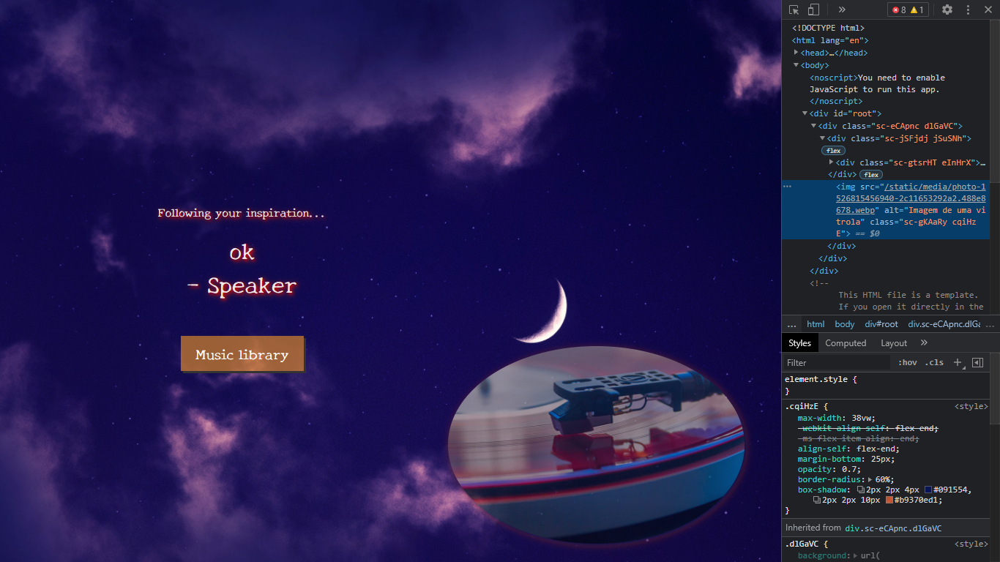

# Introdução aos React Hooks

Projeto de desenvolvimento front-end para estudar o novo React Hook. [^1]

## Dependências:

- Styled-components
- MSW (Mock Service Worker) is a library for mocking requests to actual production URI

### Imagem final do projeto:

[^1] Orientado pelo professor Celso Henrique (Software engineer) da Digital Innovation One. Trilha de Frontend.

